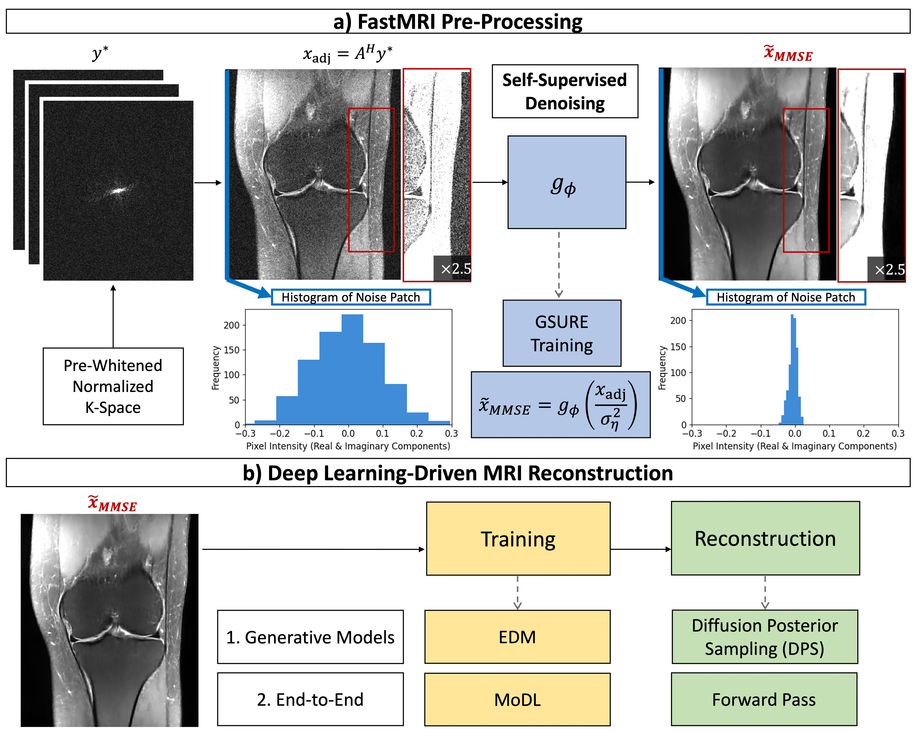

## Robust multi-coil MRI reconstruction via self-supervised denoising | MRM 2025
by [Asad Aali](https://asadaali.com/) and [Jon Tamir](http://users.ece.utexas.edu/~jtamir/csilab.html), UT CSI Lab.

Source code for paper [Robust multi-coil MRI reconstruction via self-supervised denoising](https://arxiv.org/pdf/2411.12919).



Pipeline describing the techniques utilized for: (i) GSURE Denoising, (ii) GSURE-DPS Training/Inference, and (iii) GSURE-MoDL Training/Inference.

# Instructions (Coming Soon)

# References

```bib
@misc{chung2023dps,
      title={Diffusion Posterior Sampling for General Noisy Inverse Problems}, 
      author={Hyungjin Chung and Jeongsol Kim and Michael T. Mccann and Marc L. Klasky and Jong Chul Ye},
      year={2023},
      eprint={2209.14687},
      archivePrefix={arXiv},
      primaryClass={stat.ML}
}
```

```bib
@article{karras2022elucidating,
  title={Elucidating the design space of diffusion-based generative models},
  author={Karras, Tero and Aittala, Miika and Aila, Timo and Laine, Samuli},
  journal={Advances in neural information processing systems},
  volume={35},
  pages={26565--26577},
  year={2022}
}
```

```bib
@article{aggarwal2018modl,
  title={MoDL: Model-based deep learning architecture for inverse problems},
  author={Aggarwal, Hemant K and Mani, Merry P and Jacob, Mathews},
  journal={IEEE transactions on medical imaging},
  volume={38},
  number={2},
  pages={394--405},
  year={2018},
  publisher={IEEE}
}
```

```bib
@article{eldar2008generalized,
  title={Generalized SURE for exponential families: Applications to regularization},
  author={Eldar, Yonina C},
  journal={IEEE Transactions on Signal Processing},
  volume={57},
  number={2},
  pages={471--481},
  year={2008},
  publisher={IEEE}
}
```
